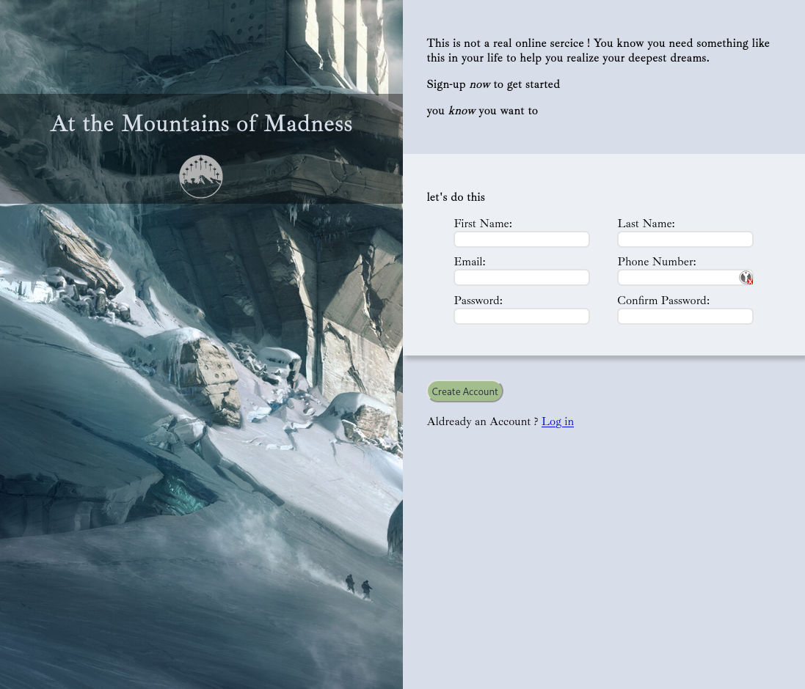

## TheOdinProject
Collection of (some) project from <a href="https://www.theodinproject.com"> The Odin Project</a>, nothing fancy here.
They just are a way to grok some concept and technology of the web.

feel free to take a look, the image are a link to the webpages

--------

#### LandingPage
  First project, plain page with HTML+CSS
  
  
  
  --------

#### AdminDashboard
  another plain page with HTML+CSs but with some work with flexbox and grid
  
  
  
  --------
  
  #### Rock Paper Scissors
  simple game to discover js and the DOM
  
  
  
  --------
  #### Calculator
  highly inefficient calculator with js
  
  
   
   --------
    
  ### Sign up form
  Yet another plain page with HTML and CSS, better looking though
  
  

   --------
   
   ### Etch a sketch
   ...
  
  
       
   --------
   
   ### Libary
   A nice library webpage to remember, which book you have read... just don't refresh the cache.
  
  
       
   --------
